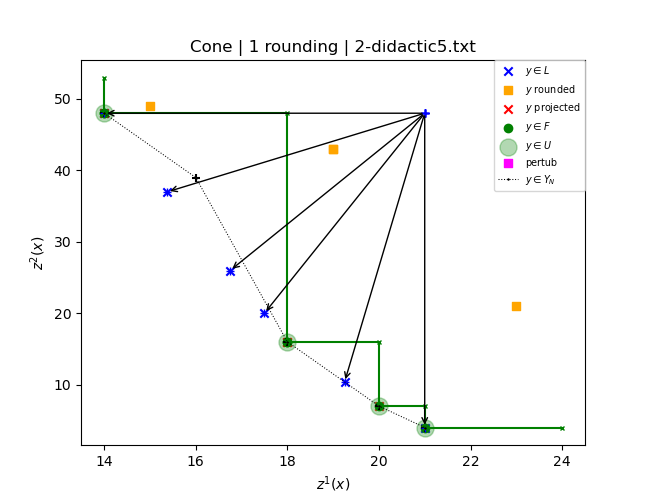

# GravityMachine
A primal heuristic to compute an upper bound set for multi-objective 0-1 linear optimisation problems

« Gravity Machine » is an algorithm aiming to compute an upper bound set for a multi-objective linear optimisation problem with binary variables.
Inspired by the well known « Feasibility Pump » algorithm in single objective optimisation, it belongs to the class of primal heuristics.

Here after an example of result for the instance `biodidactic5.txt`:

**References:**

1) Xavier Gandibleux and Saïd Hanafi. On Multi Objective Primal Heuristics. *MOPGP'21: 14th International Conference on Multiple Objective Programming and Goal Programming, 20-21 December 2021, Online.* [https://mopgp.org/](https://mopgp.org/)

2) Xavier Gandibleux, Guillaume Gasnier and Saïd Hanafi. A primal heuristic to compute an upper bound set for multi-objective 0-1 linear optimisation problems. *MODeM'21: 1st Multi-Objective Decision Making Workshop, July 14-16, 2021, Online.* [http://modem2021.cs.nuigalway.ie/](http://modem2021.cs.nuigalway.ie/)

- Paper: [http://www.optimization-online.org/DB_HTML/2021/07/8508.html](http://www.optimization-online.org/DB_HTML/2021/07/8508.html)

- Video: [https://www.youtube.com/watch?v=PGEbKthSsDM](https://www.youtube.com/watch?v=PGEbKthSsDM)

-----------------------------------------------------------------------------------------------------

Au tout début du code de GMmain.jl, vous pouvez retrouver quatre variables binaires:
La première: PlotsOuPyPlot indique si on utilise le package Plots (true) ou PyPlot (false) pour la sortie graphique.
La deuxième: borneTrue indique si on active les bornes du KP-exchange (true) ou non (false).
La troisième: KP_11_01_10_OU_22_21_11 indique si on utilise le KP 1-1, 0-1 et 1-0 (true) ou le KP 2-2, 2-1 et 1-1 (false).
La quatrième: NSGATrue indique si on effectue NSGA-II (true) ou non (false).